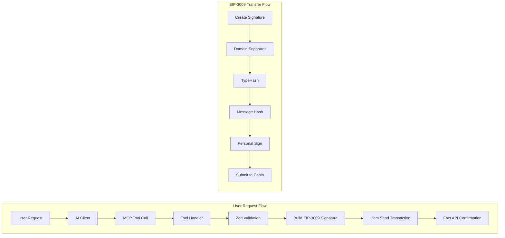

```mermaid
flowchart TB
    subgraph AI_Clients["AI Clients Layer"]
        A1[OpenCode]
        A2[Claude CLI]
        A3[Claude Desktop]
        A4[Claude Code]
    end

    subgraph MCP_Protocol["MCP Protocol Layer"]
        M1[@modelcontextprotocol/sdk]
        M2[StdioServerTransport]
        M3[MCP Tools Protocol]
    end

    subgraph Application["Application Layer"]
        S1[src/server.ts]
        T1[pay_stablecoin]
        T2[pay_test_stablecoin]
        T3[buy_apikey]
        T4[get_info]
    end

    subgraph Payment_Engine["Payment Engine Layer"]
        Z[Zod Validation]
        E[EIP-3009 Signature Builder]
        P1[TransferWithAuthorization]
    end

    subgraph Blockchain["Blockchain Layer"]
        V[viem Library]
        WC[WalletClient]
        PC[PublicClient]
        B1[Base Mainnet 8453]
        B2[Base Sepolia 84532]
    end

    subgraph External["External Services"]
        F[Fact API\nlocalhost:8787]
        RPC[Base RPC Endpoints]
    end

    subgraph Configuration["Configuration Layer"]
        ENV[CUR_ENV\ndev/prod]
        USDC[USDC Addresses]
        KEY[BUYER_PRIVATE_KEY]
    end

    AI_Clients --> MCP_Protocol
    MCP_Protocol --> Application
    Application --> Payment_Engine
    Payment_Engine --> Blockchain
    Blockchain --> External
    Configuration -.-> Blockchain
```



### Architecture Summary

| Layer | Components | Technology |
|-------|-----------|------------|
| AI Clients | OpenCode, Claude CLI, Desktop, Code | MCP Protocol |
| MCP Layer | @modelcontextprotocol/sdk | TypeScript SDK |
| Application | 4 Tools in server.ts | TypeScript |
| Payment Engine | Zod + EIP-3009 | Custom Signature Logic |
| Blockchain | viem + Base Chain | EVM Compatible |
| External | Fact API + RPC | REST APIs |
| Configuration | Environment Variables | dotenv |

### Core Flow
1. AI Client initiates MCP tool call
2. Tool handler validates input with Zod
3. Builds EIP-3009 TransferWithAuthorization
4. Signs with viem WalletClient
5. Sends transaction to Base network
6. Confirms via Fact API

### Current Status
- Version: 0.0.2
- Environment: Development (dev)
- Network: Base Sepolia (test) / Base Mainnet (prod)
- Payment Token: USDC
- Transfer Type: EIP-3009 (gasless authorization)
```