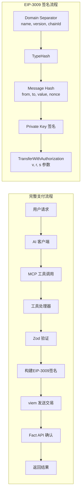

```mermaid
graph TB
    subgraph AI["AI 客户端层"]
        OC[OpenCode]
        CLI[Claude CLI]
        DESK[Claude Desktop]
        CC[Claude Code]
    end

    subgraph MCP["MCP 协议层"]
        SDK[@modelcontextprotocol/sdk]
        TRANS[StdioServerTransport]
        PROTO[MCP Tools Protocol]
    end

    subgraph APP["应用层 (server.ts)"]
        PAY[pay_stablecoin<br/>USDC支付]
        TEST[pay_test_stablecoin<br/>测试网支付]
        BUY[buy_apikey<br/>购买API密钥]
        INFO[get_info<br/>获取服务信息]
    end

    subgraph ENG["支付引擎层"]
        ZOD[Zod 验证]
        EIP[EIP-3009<br/>签名构建]
        SIGN[TransferWithAuthorization]
    end

    subgraph CHAIN["区块链层"]
        VIEM[viem 库]
        WC[WalletClient<br/>签名]
        PC[PublicClient<br/>读取]
        DEV[Base Sepolia<br/>84532]
        PROD[Base Mainnet<br/>8453]
    end

    subgraph EXT["外部服务层"]
        FACT[Fact API<br/>localhost:8787]
        RPC[Base RPC<br/>sepolia/base.org]
    end

    subgraph CFG["配置层"]
        ENV[CUR_ENV<br/>dev/prod]
        USDC[USDC 地址]
        KEY[BUYER_PRIVATE_KEY]
    end

    AI --> MCP
    MCP --> APP
    APP --> ENG
    ENG --> CHAIN
    CHAIN --> EXT
    CFG -.-> CHAIN

    style AI fill:#e1f5ff
    style MCP fill:#fff4e1
    style APP fill:#e1ffe1
    style ENG fill:#f9e1ff
    style CHAIN fill:#ffe1f5
    style EXT fill:#f5ffe1
    style CFG fill:#e1e1f5
```



## 系统架构分析

### 项目概述
- **项目名称**: @newblock/iautopay-mcp
- **版本**: 0.0.2
- **功能**: MCP服务，使AI代理能够自动支付购买费用
- **链**: Base链 (Coinbase托管)
- **支付代币**: USDC

### 七层架构

| 层 | 组件 | 技术栈 |
|---|---|---|
| AI客户端层 | OpenCode, Claude CLI, Desktop, Code | MCP协议 |
| MCP协议层 | @modelcontextprotocol/sdk | TypeScript SDK |
| 应用层 | 4个MCP工具在server.ts中 | TypeScript |
| 支付引擎层 | Zod验证 + EIP-3009签名 | 自定义逻辑 |
| 区块链层 | viem + Base链 | EVM兼容 |
| 外部服务层 | Fact API + Base RPC | REST API |
| 配置层 | 环境变量 | dotenv |

### MCP工具列表

| 工具名 | 功能 | 输入参数 |
|---|---|---|
| `pay_stablecoin` | 使用EIP-3009直接支付USDC | `to`, `amount` |
| `pay_test_stablecoin` | 测试网支付USDC | `to`, `amount` |
| `buy_apikey` | 购买GLM4.7 API密钥 | 无参数 |
| `get_info` | 获取服务器信息 | 无参数 |

### 核心支付流程
1. AI客户端发起MCP工具调用
2. 工具处理器使用Zod验证输入
3. 构建EIP-3009 TransferWithAuthorization签名
4. 使用viem签名并提交到Base链
5. 通过Fact API确认交易

### 网络配置

#### 开发环境 (dev)
- **链ID**: 84532
- **RPC**: https://sepolia.base.org
- **USDC地址**: 0x036CbD53842c5426634e7929541eC2318f3dCF7e
- **代币名**: USDC

#### 生产环境 (prod)
- **链ID**: 8453
- **RPC**: https://mainnet.base.org
- **USDC地址**: 0x833589fcd6edb6e08f4c7c32d4f71b54bda02913
- **代币名**: USD Coin

### 当前状态
- 版本: 0.0.2
- 环境: 开发 (dev)
- 转移类型: EIP-3009 (授权转账)
- 支付代币: USDC
