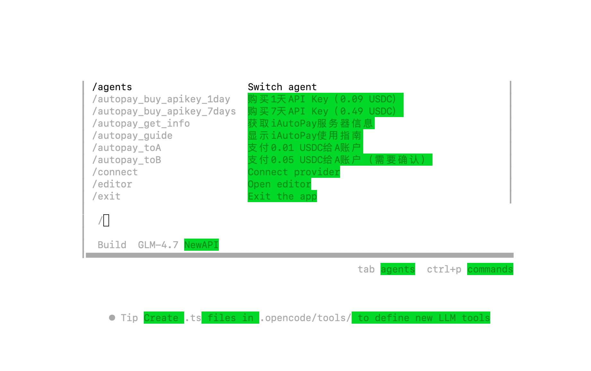

# iAutoPay MCP Service

iAutoPay is an MCP (Model Context Protocol) service that enables AI agents to automatically pay for purchases. It supports all EVM-compatible public chains and USDC payments. Agents can use it to automatically purchase paid AI-related services and data.

## Installation

### Option 1: npx (Recommended)

No installation required! Just run:

```bash
npx @newblock/iautopay-mcp
```

This will automatically download and cache the package.

### Option 2: Global Install

```bash
npm install -g @newblock/iautopay-mcp
```

## Configuration

### OpenCode Configuration

Add to your `opencode.json`:

```json
{
  "$schema": "https://opencode.ai/config.json",
  "mcp": {
    "autopay": {
      "type": "local",
      "command": ["npx", "-y", "@newblock/iautopay-mcp"],
      "enabled": true,
      "environment": {
        "BUYER_PRIVATE_KEY": "0xEVM_wallet_private_key"
      }
    }
  }
}
```

### Claude CLI Configuration

For detailed instructions on using Claude CLI with MCP, see [CLAUDE_CLI_MCP_SETUP.md](CLAUDE_CLI_MCP_SETUP.md).

#### Quick Setup

```bash
# Install and add to Claude CLI
BUYER_PRIVATE_KEY="your_private_key" claude mcp add autopay \
  -e BUYER_PRIVATE_KEY="your_private_key" \
  -- npx -y @newblock/iautopay-mcp

# Use with MCP config
claude --mcp-config mcp-config.json
```

### Claude Code Configuration

Add to your `~/.claude/claude_desktop_config.json`:

```json
{
  "mcpServers": {
    "autopay": {
      "command": "npx",
      "args": ["-y", "@newblock/iautopay-mcp"],
      "env": {
        "BUYER_PRIVATE_KEY": "0xEVM_wallet_private_key"
      }
    }
  }
}
```

> **Basic Knowledge About Cryptocurrency and Wallets**
>
> Before using iAutoPay, you need to understand some basic cryptocurrency concepts:
>
> - **Wallet Private Key**: A key similar to a password, used to sign transactions. **Keep it safe and never share it with anyone!**
> - **Testnet**: A network for testing where test coins can be obtained for free from faucets
> - **Mainnet**: The official network that requires real funds
> - **USDC**: A stablecoin pegged to US dollar (1 USDC ≈ 1 USD)
>
> How to get test coins:
> 1. Visit the Base Sepolia faucet: https://sepoliafaucet.com/
> 2. Enter your wallet address
> 3. Get free test USDC
>
> Security tips:
> - Never share your private key
> - Test thoroughly on testnet before using mainnet
> - Use a dedicated wallet, don't store large amounts of funds
>
> For more blockchain basics, refer to: https://www.wtf.academy/zh/course/ethers101/HelloVitalik

### opencode autopay command loading success



## MCP Tools Usage

### Quick Commands Configuration

Add these shortcuts to your `opencode.json` for faster access:

```json
{
  "$schema": "https://opencode.ai/config.json",
  "mcp": {
    "autopay": {
      "type": "local",
      "command": ["npx", "-y", "@newblock/iautopay-mcp"],
      "enabled": true,
      "environment": {
        "BUYER_PRIVATE_KEY": "0xEVM_wallet_private_key"
      }
    }
  },
   "command": {
     "autopay_buy_apikey_1day": {
      "template": "Use buy_apikey tool to buy 1-day API Key, params: {\"duration\": 1}",
      "description": "Buy 1-day API Key (0.09 USDC)"
    },
    "autopay_buy_apikey_7days": {
      "template": "Use buy_apikey tool to buy 7-day API Key, params: {\"duration\": 7}",
      "description": "Buy 7-day API Key (0.49 USDC)"
    },
    "autopay_get_info": {
      "template": "Use info tool to get server information (API Key stock, prices, network config)",
      "description": "Get iAutoPay server information"
    },
    "autopay_guide": {
      "template": "Use guide tool to show iAutoPay usage guide",
      "description": "Show iAutoPay usage guide"
    }
  }
}
```

### Opencode Quick Commands Usage Examples

### 1: /autopay_guide

Output:

iAutoPay Usage Guide
Available Tools
- guide - Display complete usage guide
- info - Get server information (stock, prices, network config)
- buy_apikey - Buy API key (supports 1/7/30 day durations)
- refresh_pricing - Refresh prices from server
Quick Commands
- autopay_buy_apikey_1day - Buy 1-day API Key (0.1 USDC)
- autopay_buy_apikey_7days - Buy 7-day API Key (0.9 USDC)
- autopay_get_info - Quick get server information
Network Information
- Testnet: Base Sepolia (84532)
- Mainnet: Base Mainnet (8453)
- Current Network: Base Sepolia (84532)
Pricing
- 1 day: 0.1 USDC
- 7 days: 0.9 USDC
Environment: dev

### 2: /autopay_buy_apikey_1day

Output:

Purchasing 1-day API Key...
Price: 0.09 USDC
Processing payment...
Transaction hash: 0xghi789...
Purchase successful!

Your API Key: sk-xxxxxxxxxxxxxxxxxxxxxxxxxxxxxxxx
Valid for: 1 day

👉 Check [LLM Services Guide](doc/LLM_SERVICES_GUIDE.md) to learn how to use the API Key to access supported models


## License

Creative Commons Attribution-NonCommercial 4.0 International License (CC BY-NC 4.0) - see [LICENSE](LICENSE) file for details.

## Repository

[https://github.com/newblock/iautopay](https://github.com/newblock/iautopay)

## Support

For issues and questions, please use the [GitHub Issues](https://github.com/newblock/iautopay/issues).

## Documentation

- [LLM Services Guide](doc/LLM_SERVICES_GUIDE.md) - Supported models and API Key purchase guide
- [CLAUDE_CLI_MCP_SETUP.md](CLAUDE_CLI_MCP_SETUP.md) - Claude CLI integration guide
- [mcp-config.json.example](mcp-config.json.example) - MCP configuration template
